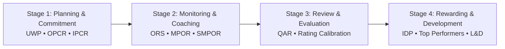

<p align="center">
  
</p>

<h1 align="center">Smart-PMS</h1>

<p align="center">
  <strong>Official Strategic Performance Management System (SPMS)</strong><br>
  <em>Provincial Government of Davao del Sur</em>
</p>

<p align="center">
  <a href="LICENSE"></a>
  <a href="https://laravel.com"></a>
  <a href="https://react.dev"></a>
  <a href="https://inertiajs.com"></a>
  <a href="https://www.php.net"></a>
</p>

---

## 📌 Overview

**Smart-PMS** is an enterprise-grade web application designed and built for the **Provincial Government of Davao del Sur**. Built in full compliance with the **Civil Service Commission (CSC) Strategic Performance Management System (SPMS)** guidelines, it modernizes and automates the entire public sector performance evaluation lifecycle—from organizational targets down to individual daily task monitoring and career development planning.

---

## 🌟 Key Features

### 🔄 End-to-End SPMS 4-Stage Lifecycle



1. **Stage 1: Performance Planning & Commitment**
   - **Unit Work Plan (UWP):** Departments structure Core, Strategic, and Support functions with Major Final Outputs (MFOs), Success Indicators, budgets, and Quality/Efficiency/Timeliness (QET) standards.
   - **Office Performance Commitment & Review (OPCR):** Department heads consolidate UWPs into official organizational commitments.
   - **Individual Performance Commitment & Review (IPCR):** Employees cascade and commit to office indicators and measurable semester targets.

2. **Stage 2: Performance Monitoring & Coaching**
   - **Output Rating Sheet (ORS / Annex G):** Granular tracking for individual tasks with live recording timers, evidence attachments, supervisor reviews, and automated scoring.
   - **Monthly Performance Output Report (MPOR):** Automatic roll-up of daily ORS achievements into monthly summaries.
   - **Summary Monthly Performance Output Report (SMPOR):** Consolidated semester-wide matrix across all monthly deliverables.

3. **Stage 3: Performance Review & Evaluation**
   - **Quarterly Accomplishment Report (QAR):** Comprehensive evaluation with adjectival ratings (*Outstanding*, *Very Satisfactory*, *Satisfactory*, *Unsatisfactory*, *Poor*).
   - **Weighted Formula Calibration:** CSC-compliant rating algorithms ($Q \times 0.3 + E \times 0.3 + T \times 0.4$).
   - **PMT Review & Approval Workflow:** Formal multi-step review, calibration, approval, or return-with-remarks.

4. **Stage 4: Rewarding & Development Planning**
   - **Individual Development Plan (IDP / Annex H):** Post-evaluation gap analysis, targeted interventions, and supervisor commitments.
   - **Top Performing Employees Recognition:** Data-driven ranking and commendation matrix for outstanding civil servants.
   - **L&D / HRMO Integration:** Direct payload exports for institutional human resource development interventions.

---

### 💼 Smart Platform Capabilities

- 📊 **Programmatic CSC Excel Workbooks:** Export pixel-perfect, government-standard Excel spreadsheets (OPCR, IPCR, UWP, ORS Annex G, MPOR, SMPOR, QAR, IDP Annex H) powered by PhpSpreadsheet.
- 🆔 **Automated PMS-ID Generation:** Role-based smart identifier system (`ADM-`, `PMT-`, `DPT-`, `SPV-`, `EMP-`) with email onboarding and self-activation links.
- 🤖 **Machine Learning KPI Predictions:** Built-in ML regression forecasting model assessing employee milestone trends and accomplishment trajectories.
- 🔒 **Enterprise Security & Compliance:** Laravel Fortify authentication, Two-Factor Authentication (2FA), Passkey / WebAuthn support, and Role-Based Access Control (RBAC).
- 📜 **Full Audit Logging:** Detailed event and activity logging via Spatie Activitylog across all rating updates, role adjustments, and document approvals.
- 🌓 **Modern Responsive Interface:** React 18 + Inertia.js with dark/light mode, real-time feedback, and accessible navigation.

---

## 👥 User Roles & Access Matrix

| Role | Badge | Key Responsibilities & Capabilities |
| :--- | :---: | :--- |
| **System Administrator** | `admin` | User management, PMS-ID generation, office registry, system settings, activity logs, role delegation. |
| **Performance Management Team** | `pmt` | SPMS calibration, OPCR & IPCR final approvals, top performer rankings, L&D submission tracking. |
| **Department Head** | `dept-head` | OPCR formulation, department-wide UWP consolidation, quarterly performance reviews, rating validation. |
| **Supervisor** | `supervisor` | UWP creation, indicator cascading, ORS task verification, live rating/coaching, IDP review. |
| **Employee** | `employee` | IPCR target commitments, ORS task timer & evidence logging, accomplishment viewing, IDP formulation. |

---

## 🛠️ Technology Stack

### Backend
- **Framework:** [Laravel 12.x](https://laravel.com/) (PHP 8.2+)
- **Database:** MySQL / [TiDB Cloud](https://www.pingcap.com/tidb-cloud/) (Distributed SQL)
- **Authentication:** Laravel Fortify, Two-Factor Auth (2FA), Passkeys (WebAuthn)
- **Permissions:** [Spatie Laravel-Permission](https://spatie.be/docs/laravel-permission/)
- **Audit Logs:** [Spatie Laravel-Activitylog](https://spatie.be/docs/laravel-activitylog/)
- **Spreadsheet Generation:** [PhpSpreadsheet](https://phpspreadsheet.readthedocs.io/)

### Frontend
- **SPA Bridge:** [Inertia.js v2](https://inertiajs.com/)
- **Library:** [React 18](https://react.dev/)
- **Bundler:** [Vite 6](https://vitejs.dev/)
- **Icons:** [Bootstrap Icons](https://icons.getbootstrap.com/)
- **Styling:** Custom CSS Design System (Theme-aware Light/Dark mode, Glassmorphism, Responsive CSS Tokens)

---

## 🚀 Getting Started

### Prerequisites
- **PHP** $\ge$ 8.2 with `intl`, `pdo_mysql`, `gd`, `zip`, `bcmath` extensions
- **Composer** $\ge$ 2.x
- **Node.js** $\ge$ 18.x & **NPM**
- **MySQL** $\ge$ 8.0 or **TiDB Cloud** instance

---

### Installation Steps

1. **Clone the Repository**
   ```bash
   git clone https://github.com/makinity/Smart-PMS.git
   cd smart-pms
   ```

2. **Install Dependencies**
   ```bash
   composer install
   npm install
   ```

3. **Configure Environment**
   ```bash
   cp .env.example .env
   php artisan key:generate
   ```
   *Update your `.env` with your database credentials, mail settings, and application URL.*

4. **Run Migrations & Seed Database**
   ```bash
   # For local development with full demo data:
   php artisan migrate:fresh --seed

   # For production initialization (Admin & core roles only):
   php artisan migrate --force
   php artisan db:seed --class=ProductionSeeder --force
   ```

5. **Symlink Storage & Build Assets**
   ```bash
   php artisan storage:link
   npm run build
   ```

6. **Start Local Development Server**
   ```bash
   # Terminal 1: Vite Dev Server
   npm run dev

   # Terminal 2: Laravel Server
   php artisan serve --port=8080
   ```
   Access the system at `http://localhost:8080`.

---

## 🧪 Testing

Run the automated test suite with PHPUnit / Pest:

```bash
# Run all feature and unit tests
php artisan test

# Run a specific test suite
php artisan test --filter=OrsExcelExportTest
php artisan test --filter=UserManagementTest
```

---

## 📖 Administrator Documentation

For detailed step-by-step instructions on bootstrapping a new instance, provisioning department heads, registering employees, and setting up initial performance periods, please refer to:

👉 **[SETUP.md](SETUP.md)** — *Smart-PMS System Administrator Setup Guide*

---

## 📄 License

This project is licensed under the **MIT License** — see the [LICENSE](LICENSE) file for details.

---

<p align="center">
  Developed for the <strong>Provincial Government of Davao del Sur</strong><br>
  <em>Modernizing Governance through Smart Performance Management</em>
</p>