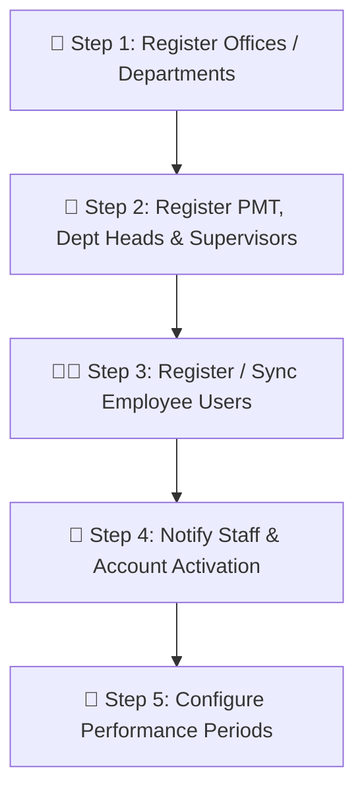

# 📘 Smart-PMS System Administrator Setup Guide

Welcome to **Smart-PMS (SPMS Performance Management System)**. This document serves as the official, step-by-step onboarding guide for the **System Administrator** to configure and bootstrap the system for initial production rollout.

---

## 🔑 1. Initial Administrator Credentials

Upon initial database migration and seeding, the Master Administrator account is provisioned:

| Parameter | Initial Value |
| :--- | :--- |
| **Login URL** | `https://your-domain.com/login` *(or `http://localhost:8080/login` in local setup)* |
| **Email Address** | `smartpms.davaodelsur@gmail.com` *(or as defined in `ProductionSeeder.php`)* |
| **Initial Password** | `password` |
| **Assigned Role** | `System Administrator (admin)` |

> [!IMPORTANT]
> **First Action Required:** Immediately after logging in for the first time, navigate to **Profile Settings** to update your password to a strong, secure passphrase.

---

## 🚀 2. Database Initialization (Production Seeding)

To initialize the core system roles and bootstrap the master administrator account on a clean database, execute:

```bash
php artisan migrate --force
php artisan db:seed --class=ProductionSeeder --force
```

### What `ProductionSeeder` Provisions:
1. **Core System Roles:** `admin`, `pmt`, `dept-head`, `supervisor`, `employee` in the permissions registry.
2. **Master Administrator Account:** Creates both the authentication record (`users` table) and administrative profile (`employees` table).

---

## 📋 3. Step-by-Step Initial Configuration Order

To ensure data integrity and avoid orphaned records, the Administrator must follow this setup sequence:



---

### 🏢 Step 1: Register Offices / Departments First
*Navigate to: **Admin Dashboard ➔ Offices / Departments***

Before adding any staff or department heads, **all organizational offices and operating units must be registered**.

1. Click **Add Office / Create New Office**.
2. Enter the **Office Name** (e.g., `Human Resource Management Office`, `City Budget Office`).
3. Enter the official **Office Code / Acronym** (e.g., `HRMO`, `CBO`).
4. *(Optional)* Leave Department Head blank for now (assigned in Step 2).

> [!NOTE]
> All subsequent user registrations, OPCRs, and Unit Work Plans are tied directly to an office. Creating offices first is mandatory.

---

### 👥 Step 2: Register Leadership & Key System Staff
*Navigate to: **Admin Dashboard ➔ User Management ➔ Create User***

Create the key institutional actors in the SPMS cycle:

1. **Performance Management Team (PMT):**
   - Role: `pmt`
   - Function: Reviews OPCRs, conducts calibration, and oversees final rating releases.
2. **Department Heads:**
   - Role: `dept-head`
   - Select their assigned **Office / Department**.
   - Function: Formulates Office Performance Commitment and Reviews (OPCR).
3. **Unit / Division Supervisors:**
   - Role: `supervisor`
   - Select their assigned **Office / Department**.
   - Function: Approves individual tasks (ORS), IPCR targets, and conducts intermediate reviews.

---

### 🧑‍💼 Step 3: Register Employee Users
*Navigate to: **Admin Dashboard ➔ User Management***

You have two options for onboarding employee accounts:

#### Option A: Sync from HRMO Hub / HRIS / RSP (Recommended for Large Teams)
- If your instance is connected to the centralized HRIS / RSP system, use the **HRIS Sync** feature to batch-import employees with their corresponding position titles, office assignments, and employee numbers.

#### Option B: Manual Registration
- Click **Create User**, fill in:
  - **PMS ID** (Auto-generated with role prefix or enter custom ID e.g., `EMP-10523`)
  - **Full Name** (First, Middle, Last)
  - **Email Address** (Valid Gmail or corporate email)
  - **Assigned Office** & **Position Title**
  - **Role:** `employee`

---

### 📧 Step 4: Account Activation & Email Notification Workflow

When a user account is created or imported, the system generates an activation token and dispatches an onboarding email:

1. **Email Contents:**
   - User's designated **PMS ID** (e.g., `ADM-XXXXX`, `PMT-XXXXX`, `DPT-XXXXX`, `SPV-XXXXX`, `EMP-XXXXX`).
   - Secure one-time activation link to set up their password.
2. **Administrator Action:**
   - Remind newly registered staff and employees to check their **Gmail / Corporate Email inbox** (and Spam/Junk folder if not immediately visible) for their activation link and `PMS ID`.
   - Once activated, users can sign in using their **Email** and newly chosen password.

> [!TIP]
> **PMS ID Role Prefixes:**
> - `ADM-` ➔ System Administrators (e.g., `ADM-00001`)
> - `PMT-` ➔ Performance Management Team (e.g., `PMT-48192`)
> - `DPT-` ➔ Department Heads (e.g., `DPT-10394`)
> - `SPV-` ➔ Unit / Division Supervisors (e.g., `SPV-67210`)
> - `EMP-` ➔ Regular Employees (e.g., `EMP-84920`)

---

### 📅 Step 5: Configure Performance Periods
*Navigate to: **Admin Dashboard ➔ Performance Periods***

To allow departments and employees to begin Stage 1 (Unit Work Plan, Target Commitments, and IPCR):

1. Click **Create Performance Period**.
2. Enter the Period Name (e.g., `Jan–Jun 2026` or `Jul–Dec 2026`).
3. Set the official **Start Date** and **End Date**.
4. Set the status to **Active / Open**.

---

## 🛠️ 4. Quick Troubleshooting & Checklist

| Check | Expected State | Action if Issue Occurs |
| :--- | :--- | :--- |
| **Mail Delivery** | Activation emails sending properly | Check `MAIL_*` environment variables in `.env` (SMTP Host, Port, Username, App Password). |
| **Storage Link** | Profile photos and attachments loading | Run `php artisan storage:link` on the server. |
| **Role Permissions** | Role dropdown populated in User Creation | Run `php artisan db:seed --class=ProductionSeeder`. |
| **Active Period** | Users able to create UWPs/IPCRs | Ensure at least one Performance Period has status set to `Active`. |

---

*Document maintained for Smart-PMS Administrators.*
